# **C Language**

---

## 1. point解釋 : 記錄某個變數、陣列或函式的記憶體位址

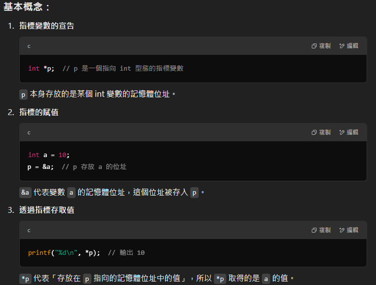
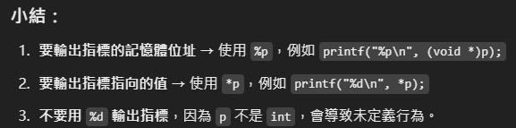

## 2. example

```c
#include <stdio.h>

void func(int *ptr){
    (*ptr)++;
}

int main(){
    int num = 5;
    func(&num);
    printf("num:%d\n",num);     //ans : 6, ptr++ : num = 5
    return 0;
}
// ptr++：它將指標 ptr 的值增加，使其指向下一個記憶體位置。
// (*ptr)++：使用 *ptr 解引用指標，取得指標所指向的值，然後對該值進行遞增操作 ++。
```

## 3. example

```c
#include <stdio.h>

void func1(){
    printf("a\n");
}

void func2(){
    printf("b\n");
}

int main() {
    void (*fp[2]) ();
    fp[0] = func1;
    fp[1] = func2;

    fp[0]();
    fp[1]();
    return 0;
}
```

## 4. 解釋以下指標意義

```c
int a;             
int *a;            
int **a;           
int a[10];         
int *a[10];        
int [*a](10);      
int (*a)(int);     
int (*a[10])(int); 

// 一個整數型別
// 一個指向整數的指標
// 一個指向指標的指標，而"指向的指標"是指向一個整數型別
// 一個有10個整數型的陣列
// 一個有10個指標的陣列，該指標是指向一個整數型別
// 一個指向有10個整數型陣列的指標
// 一個指向函數的指標，該函數有一個整數型參數並返回一個整數
// 一個有10個指標的陣列，該指標指向一個函數，該函數有一個整數型參數並返回一個整數

```

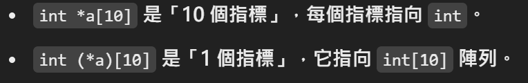

## 5. 寫一個function讓變數a跟b能夠交換，不透過暫存變數

```c
#include <stdio.h>

void swap(int *a, int *b) {
    *a = *a ^ *b;
    *b = *a ^ *b;
    *a = *a ^ *b;
}

int main() {
    int a = 5;
    int b = 10;
    printf("Before: a = %d, b = %d\n", a, b);
    swap(&a, &b);
    printf("After: a = %d, b = %d\n", a, b);
    return 0;
}
```

## 6. 回答printf的答案

```c
#include <stdio.h>

int main(void) {
    char *str[] = {
        {"MediaTekOnlineTesting"},
        {"WelcomeToHere"},
        {"Hello"},
        {"EverydayGenius"},
        {"HopeEverythingGood"}
    };    
    int a[10] = {1, 2, 3, 4, 5, 6, 7, 8, 9, 10};
    char* m = str[4] + 4;
    char* n = str[1];
    char* p = *(str+2) + 1;
    int *q = &(a + 1)[3];
    printf("1. %s\n", *(str+1));
    printf("2. %s\n", (str[3]+8));
    printf("3. %c\n", *m);
    printf("4. %c\n", *(n+3));
    printf("5. %c\n", *p + 1);
    printf("6. %d\n", *q);
    return 0;
} 
// 1. WelcomeToHere
// 2. Genius
// 3. E
// 4. c
// 5. f
// 6. 5
```

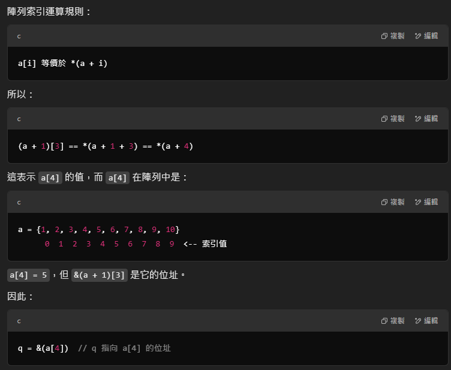
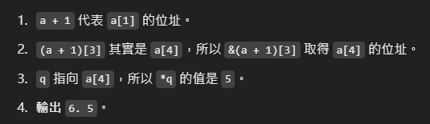

## 7. 回答陣列的答案

```c
#include <stdio.h>

int main() {
    int a[] = {6, 7, 8, 9, 10};
    int *p = a;
    *(p++) += 100;
    *(++p) += 50;
    for (int i = 0; i < 5; i++) {
        printf("a[%d] = %d\n", i, a[i]);
    }
}
// a[0] = 106
// a[1] = 7
// a[2] = 58
// a[3] = 9
// a[4] = 10
```

## 8. 回答以下問題的答案

```c
#include <stdio.h>

int main() {
    int a[5] = {1, 2, 3, 4, 5};
    int *p = (int*)(&a+1);
    printf("%d\n", *(a+1));
    printf("%d\n", *(p-1));
    return 0;
}
// Ans : 2,5 
```

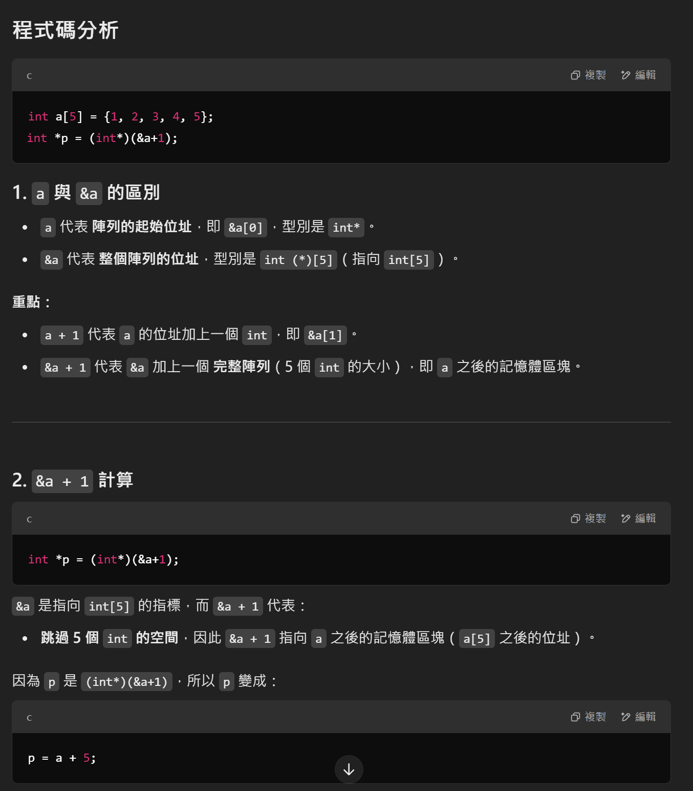
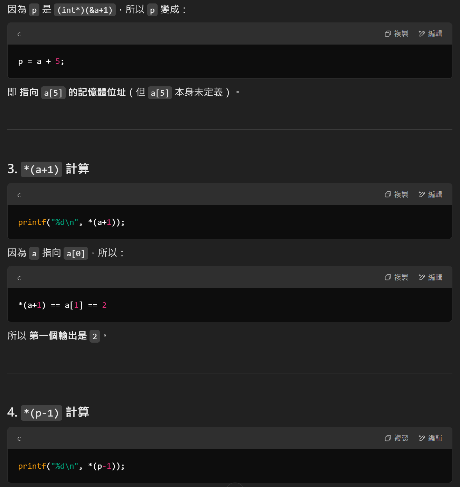


## 9. 請問輸出為何

```c
#include <stdio.h>

int main() {
    char i[ ] = "Hello";
    char a = 1;
    char *p = &a;
    int n = 10;
    printf("%d %d %d\n", sizeof(i), sizeof(p), sizeof(n));
    return 0;
}
// 6,8,4
```

## 10. 請問輸出為何

```c
#include <stdio.h>

int main(){
    int arr[] = {10,20,30,40,50};
    int *ptr1 = arr;
    int *ptr2 = arr + 5;
    printf("%d", (ptr2-ptr1));
    printf("%d", (char*)ptr2 - (char*)ptr1);
}
// 5,20(5*4)
```


## 11. 請問輸出為何

```c
#include <stdio.h>

int main(){
    int arr1[] = {10,20};
    int arr2[] = {10,20};
    int arr3[] = {10,20};
    int *p = arr1;
    int *q = arr2;
    int *r = arr3;
    ++*p;
    *q++;
    *++r;
    printf("%d %d %d\n", arr1[0], arr1[1], *p);
    printf("%d %d %d\n", arr2[0], arr2[1], *q);
    printf("%d %d %d\n", arr3[0], arr3[1], *r);
}
// 11 20 11
// 10 20 20
// 10 20 20
```

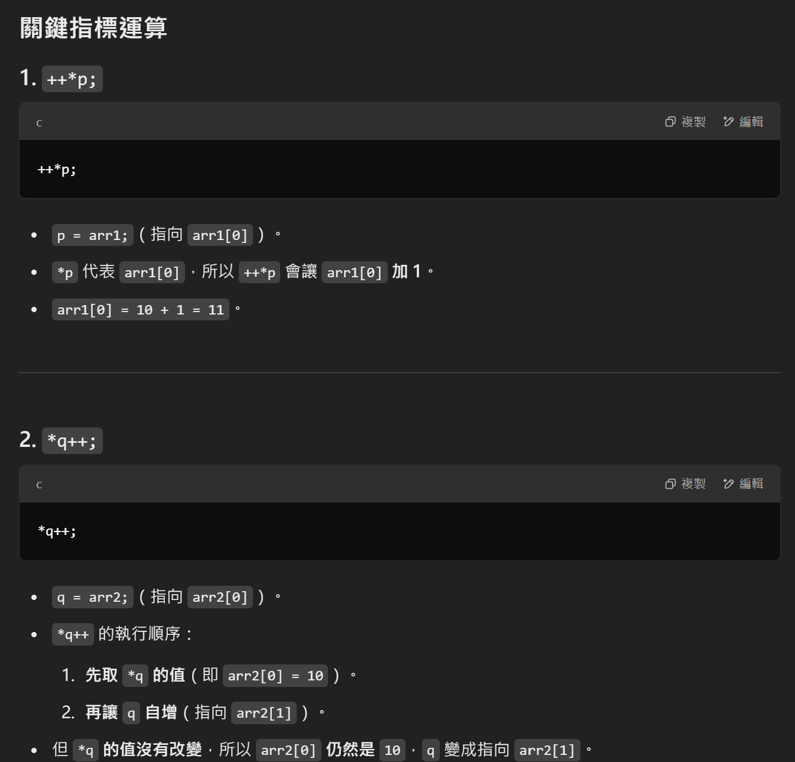
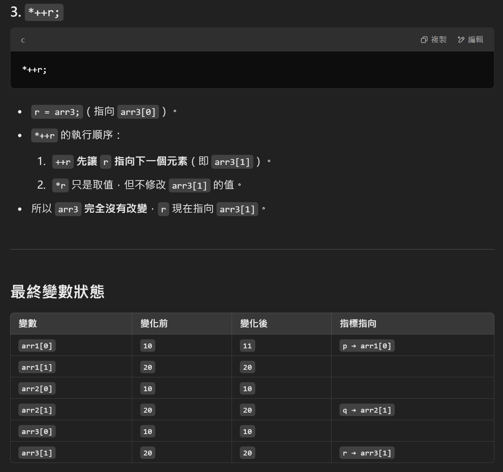
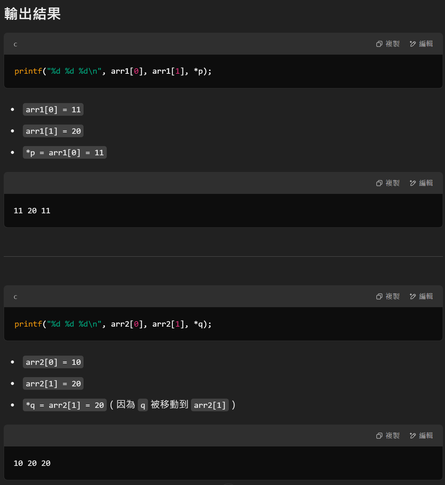
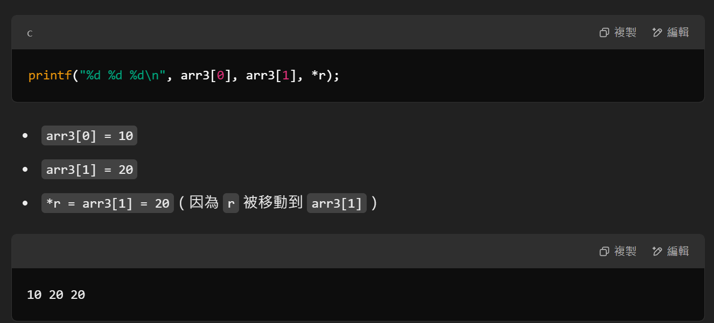

## 12. 請問輸出為何

```c
#include <stdio.h>

void f1(int *p, int *q){
    p = q;
    *p = 2;
}

void f2(int *p, int *q){
    *p = *q;
    *p = 2;
}

int main(){
    int i=0, j=1;
    f1(&i, &j);
    printf("%d %d\n", i, j);

    i=0, j=1;
    f2(&i, &j);
    printf("%d %d\n", i, j);
    return 0;
}
// 0 2
// 2 1
```

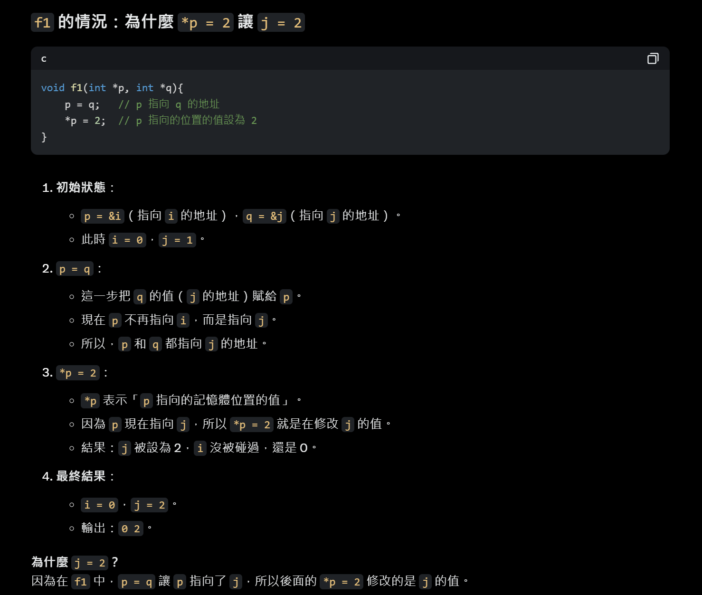
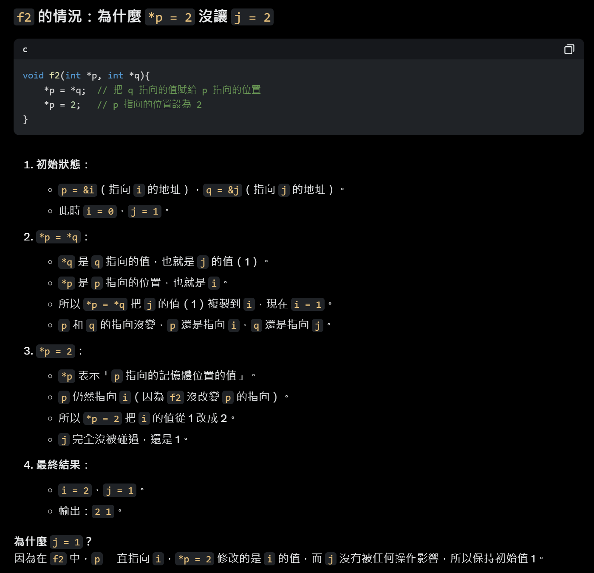

## 13. 請問輸出為何

```c
#include <stdio.h>

int main(){
    int ref[]={8,4,0,2};
    int *ptr;
    int index;
    for(index=0, ptr=ref; index<2; index++,ptr++)
        printf("%d %d\n", ref[index], *ptr);
    (*ptr++);
    printf("%d %d\n", ref[index], *ptr);
}
/*
 * 8 8
 * 4 4 
 * 0 2
 */    
```

## 14. 請問輸出為何

```c
#include <stdio.h>

int main() {
    char *str[ ][2] =
        { "professor", "Justin" ,
        "teacher", "Momor" ,
        "student", "Caterpillar"};

    char *str2[ ][3] =
        { "professor", "Justin" ,
        "teacher", "Momor" ,
        "student", "Caterpillar"};

    char str3[3][10] = {"professor", "Justin", "etc"};
    printf("%s\n",str[1][1]); 
    printf("%s\n",str2[1][1]);
    printf("%c\n",str3[1][1]); 
}
// Momor
// student
// u
```
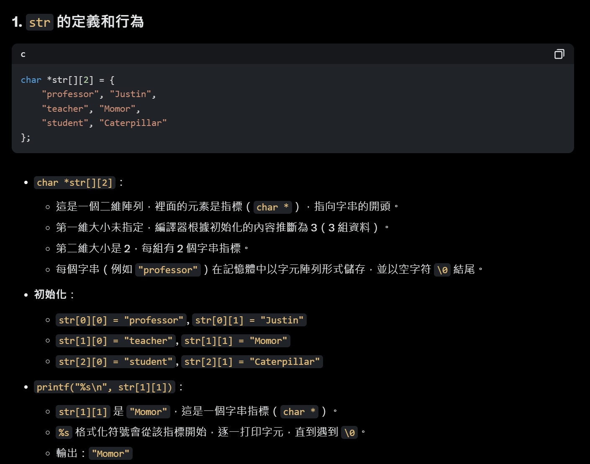
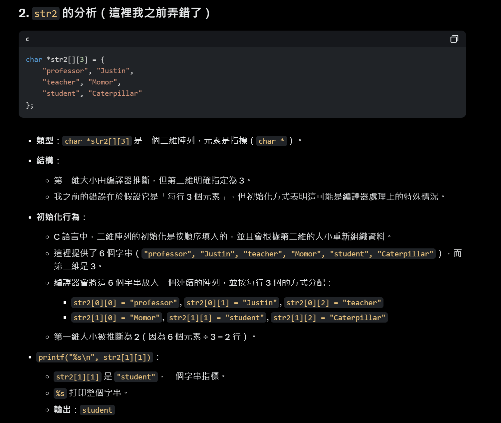
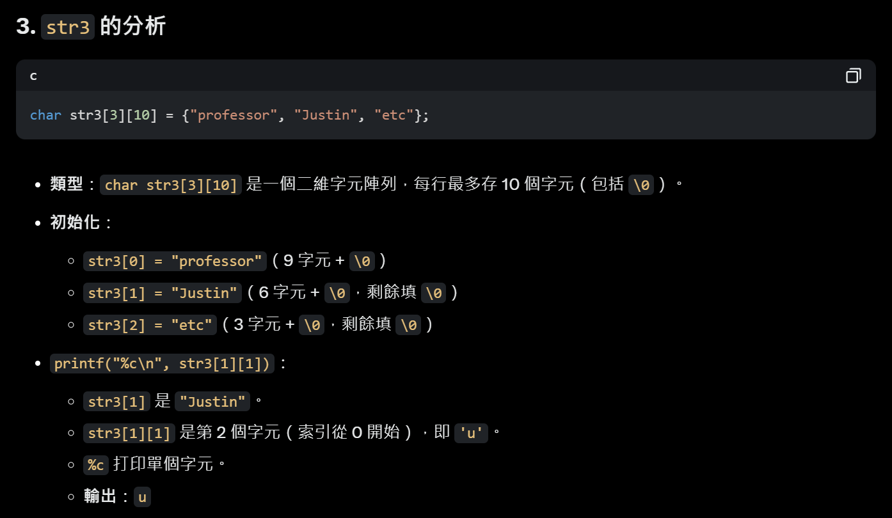

## 15. 請問輸出為何?

```c
#include <stdio.h>

int main() {
    int cnt = 10;
    const char *pc = "welcome";
    while(*pc++)
        cnt++;
    printf("cnt:%d\n",cnt);
}
// 17
```

## 16. different between pointer and array (memory)

```c
就記憶體方向來看，指標所用的記憶體位置不為連續，而陣列所配置的空間為連續。
```

## 17. call by value, call by reference, call by address解釋?

```c
call by value : 當一個變數作為參數傳遞給一個函式時，
函式接收的是該變數的副本，而不是原始變數本身(C 只有 call by value)

#include <stdio.h>

int swap(int a, int b)
{
    int temp = a;
    a = b;
    b = temp;
}

int main(void)
{
    int a = 5;
    int b = 10;
    swap(a, b);
    printf(" a = %d b = %d", a, b); // a = 5,b = 10
}

// 數值沒交換是因為在 C 語言中，默認的參數傳遞是call by value，函數內部改變的參數並不能影響到函數外的變數。
```

```c
call by reference : 當一個變數作為參數傳遞給一個函式時，
函式接收的是該變數的記憶體位址(c++才有)

#include <cstdio>

void swap(int &c, int &d)
{
    int temp = c;
    c = d;
    d = temp;
}
int main()
{
    int a = 5, b = 10;
    swap(a, b);
    printf(" %d %d ", a, b);
    return 0;
}

// 在 C 語言中沒有Call by reference,故編譯時會有錯誤
```

```c
## call by address : 當一個變數作為參數傳遞給一個函式時，
函式接收的是該變數的記憶體位址

#include <stdio.h>

int swap(int *a, int *b)
{
    int temp = *a;
    *a = *b;
    *b = temp;
}

int main(void)
{
    int a = 5;
    int b = 10;
    swap(&a, &b);
    printf(" a = %d b = %d", a, b);// a = 10, b = 5
}

// 透過指標去傳遞位址(Call by address)，可將函數內的變數作為指向該變數的指標傳遞給函數，從而讓函數內的變數直接更改函數外的變數。
```

## 18. local variable : 僅活在該函式內，存放位置在 stack 或 heap 記憶體中

```c
這範例太爛
#include <stdio.h>

void count() 
{ 
    int c = 1; 
    printf("%d\n", c); // c = 1 c = 1...
    c++; 
}

int main(void) 
{ 
    for(int i = 0; i < 10; i++)
        count(); 
    return 0; 
} 
```

## 19. static variable : ?

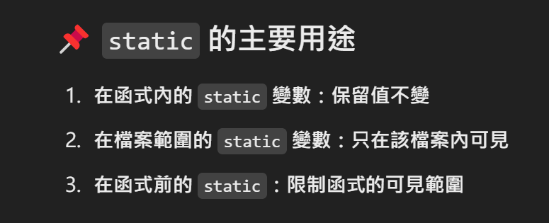
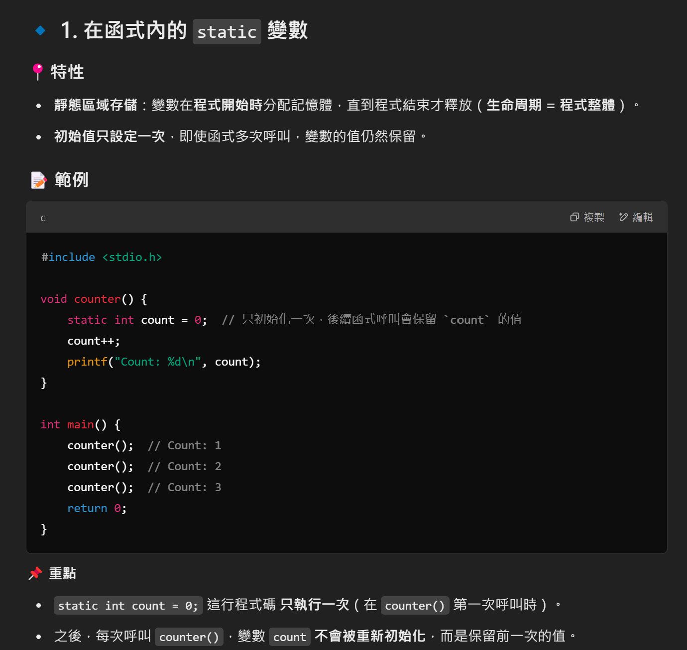
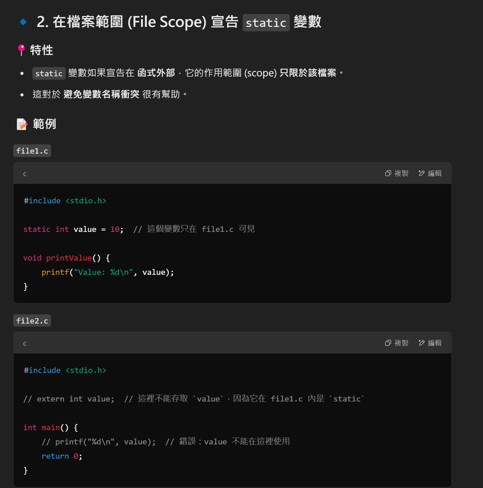
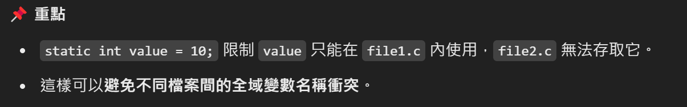
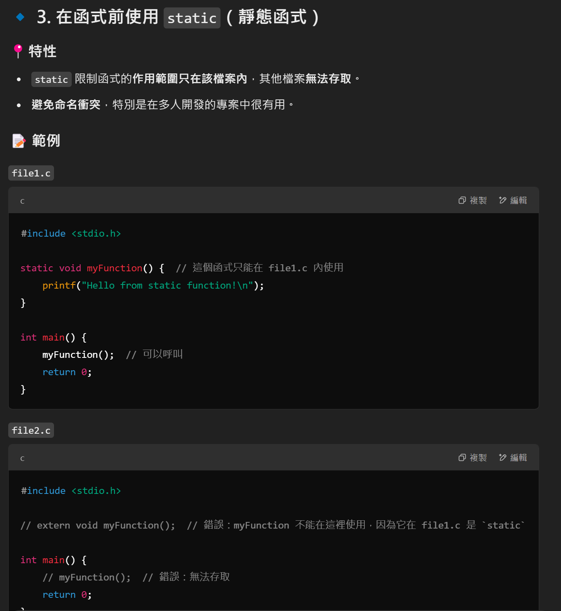
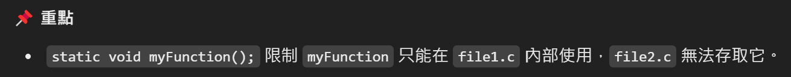

## 20. global variable : 所有區域皆可使用此變數

```c
#include <stdio.h>

int c = 1; 

void count() 
{ 
    printf("%d\n", c); // c = 1 c = 2...
    c++; 
}

int main(void)
{ 
    for(int i = 0; i < 10; i++)
        count(); 
    return 0; 
} 
```

## 21. extern : 用於聲明外部變數，如果變數需要在多個文件中共享，就需要使用 extern 聲明該變數；如果變數只在當前文件中使用，可以不使用 extern 關鍵字聲明

```c
// var.c
int a = 10;
```

```c
// main.c
#include "var.c" 

extern int a;

int main() {
    printf("a = %d\n", a); //a = 10
    return 0;
}
```

## 22. const : 通常表示只可讀取不可寫入的變數，常用來宣告常數，特性如下

```c
#include <stdio.h>

int main(void)
{
    int n1 = 10, n2 = 100;

    const int* ptr1 = &n1; // ptr1是一個指向const的整數指標
    // *ptr1 = 20; // X
    ptr1 = &n2; // O (ptr1 = 100)
    printf("%d\n", *ptr1);

    int* const ptr2 = &n1; // ptr2是一個指向整數的const指標
    *ptr2 = 20; // O (ptr2 = 20)
    // ptr2 = &n2; // X
    printf("%d\n", *ptr2);
}
```

## 23. volatile : 編譯器不對 volatile 修飾的變數進行最佳化處理,而是每次都去讀取變數實際上最新的數值，應用如下

```text
1. 修飾中斷處理程式中(ISR)中可能被修改的全域變數

2. 修飾多執行緒(multi-threaded)的全域變數

3. 設備的硬體暫存器(如狀態暫存器)
```

```c
extern const volatile unsigned int rt_clock;
// 這是在 RTOS kernel 常見的一種宣告：rt_clock通常是指系統時鐘，它經常被時鐘中斷進行更新。所以它是volatile。
```

## 24. inline寫法

```c
inline int square(int x) 
  return x * x;
```

## 25. Macro寫法

```c
# define SQUARE(x) ((x) * (x))
printf("\n %d", SQUARE(5)); // 若在主程式中，下述能得到 25，看起來沒有問題
printf("\n %d", SQUARE(3+2)); // 但如果是以下，卻會得到 11 (3+2 * 3+2)
```

## 26. inline / Macro差異

```c
macro : 在前置處理器(preprocessor)階段時,直接進行文字替換
inline : 在編譯(compile)階段時,直接取代function
```


## 27. #define : 是巨集的一種，在前置處理器(preprocessor)執行時處理，將要替換的程式碼展開做文字替換。define 語法範例如下

```c
#define PI 3.1415926
#define A(x) x 
#define MIN(A,B)  ((A) <= (B) ? (A) : (B))

// Example : 
#include <stdio.h>

#define MUX(a,b) a*b
int main() {
    printf("%d\n", MUX(10+5,10-5));
    return 0;
}
// 55
```

## 28. 引入防護和條件編譯 : 防範 #include 指令重複引入的問題

```c
#ifndef MYHEADER // 避免重複引入
#define MYHEADER
...
#endif
```

## 29. #define swap

```c
#include <stdio.h>

#define swap(a,b) {int temp = a; a = b; b = temp;}

int main(){
    int a = 5;
    int b = 10;
    printf("before a=%d,b=%d\n",a,b);
    swap(a,b);  // = {int temp = a; a = b; b = temp;}
    printf("after a=%d,b=%d\n",a,b);

    return 0;
}
```

## 30. 解釋 Interrupt 的處理流程

```text

Interrupt（中斷）的意義
它的核心意義是打斷當前正在進行的任務，去處理另一個更緊急或需要即時響應的事件。

1. 觸發中斷(Interrupt)

2. 儲存目前 CPU 的執行狀態

3. CPU 查詢中斷向量表，並跳轉到對應之 ISR

4. 執行 ISR 裡的內容

5. ISR 執行完成後繼續執行被中斷打斷的原始程式

*什麼是中斷向量表？
中斷向量表是一個儲存在記憶體中的表格，表格的每一項（稱為「向量」）對應一個特定中斷或異常類型，
並記錄了該中斷對應的處理程序（ISR）的記憶體地址。當 CPU 接收到中斷時，
它會參考這個表格，找到並跳轉到正確的處理程式。

*ISR 是 Interrupt Service Routine 的縮寫，中文通常翻譯為中斷服務常式或中斷處理程式。
它是計算機系統中專門用來處理中斷（Interrupt）的一段程式碼。當某個中斷事件發生時，
CPU會暫停當前任務，跳轉到對應的ISR去執行，完成特定工作後再返回原本的程式流程。
```

## 31. Interrupt 有哪些

```text
1. 外部中斷（External Interrupt）：這種中斷是由於外部事件或設備引發的。MCU可以設定外部中斷接腳，當接腳狀態發生變化時（如電位上升或下降），觸發相應的中斷。例如，按下按鈕、感應器檢測到特定事件或外部設備發送的訊號等。

2. 計時器中斷（Timer Interrupt）：MCU通常具有內部的計時器/計數器模組，可以用於定時和計數操作。這種中斷是在特定時間間隔或計數達到特定值時觸發的。定時器中斷常用於進行定時任務、計時操作或產生精確的時間延遲。

3. 串列通訊中斷（Serial Communication Interrupt）：MCU通常支援不同的串列通訊協議，如UART（Universal Asynchronous Receiver-Transmitter）或SPI（Serial Peripheral Interface）。這種中斷是在接收到完整的串列數據、發送數據完成或發生通訊錯誤時觸發的。

4. ADC中斷（Analog-to-Digital Converter Interrupt）：MCU通常具有ADC模組，用於將類比信號轉換為數位值。這種中斷是在ADC完成轉換並提供新的數位值時觸發的。它可以用於即時監測類比信號的變化，例如溫度、光照等。

5. 內部中斷（Internal Interrupt）：這種中斷是由MCU內部事件觸發的。例如，存儲器錯誤、數學錯誤或其他不正常狀態等。內部中斷可以用於處理系統錯誤或異常情況。
```

## 32. different between interrupt and polling

```text
interrupt : 
1. 提高效率：不必讓CPU一直輪詢（polling）檢查是否有事件發生，減少資源的浪費。
2. 即時性：保證關鍵事件（例如硬體故障或用戶輸入）能被快速處理。

polling : 它是一種定時檢查的方式，當檢查到有事件發生時才會去執行它
```

## 33. struct : 結構是一種使用者自定的型態，它可將不同的資料型態串在一起

```c
#include <stdio.h>

struct student{
  int id;
  char name[10];
};

int main(void) {
  student john = {291, {'j', 'o', 'h', 'n', '\0'}};
  printf("學號：%d\n", john.id);
  printf("姓名：%s\n", john.name);
  return 0;
}
```

## 34. 不同類型的Byte大小

以下都為16位元
|Type       |64-bit |32-bit |
|-----------|-------|-------|
|char       |1      |1      |
|short      |2      |2      |
|int        |4      |4      |
|long       |8      |4      |
|long long  |8      |8      |
|double     |8      |8      |
|long double|16     |12     |
|point      |8      |4      |
|size_t     |8      |4      |

## 35. struct佔幾個byte

```c
#include <stdio.h>

typedef struct MyStruct1
{
    char a[2];
    int b;
    double c;
    int *Pint;
    char d;
    char* Pchar;
} MyStruct1;

typedef struct MyStruct2
{
    char a;
    char b;
    struct str2
    {
        int d;
    } c;
}MyStruct2;

typedef struct MyStruct3
{
    char a;
    int b;
    char c;
    char* d;
    double* e;
    struct str3
    {
        int f;
        char g;
        struct str33
        {
            char* p;
        }n;
    } m;
}MyStruct3;

typedef struct MyStruct4
{
    char a;
    char b;
    struct str4
    {
        char c;
        char d;
    };
}MyStruct4;

int main() {
    printf("1. %zu\n", sizeof(MyStruct1));
    printf("2. %zu\n", sizeof(MyStruct2));
    printf("3. %zu\n", sizeof(MyStruct3));
    printf("4. %zu\n", sizeof(MyStruct4));
    return 0;
}
//ans = 4(2+2對齊)+4+8+8+8(1+7對齊)+8 = 40Byte
//ans = 4(1+1+2)+4 = 8byte
//ans = 4(1+3)+4+8(1+7後面接8所以要+7才能是8的倍數)+8+8+4+4(1+3因為+3後就是40了為8的倍數)+8 = 48byte
//ans = 1+1 = 2byte  *並沒有申明這個結構體的變數所以str2不用計算
```

## 36. union : 在語法結構上，union與 struct 類似，都是使用者自定義的資料結構，最大差異在於 union 結構中的各變數是共用記憶體位置，並且在任何時候，只有一個變數的值是有效的，這取決於最後一次賦值的變數

```c
union myUnion {
    int i;
    float f;
    char c;
};

int main() {
    union myUnion u;
    u.i = 42;
    printf("u.i = %d\n", u.i);  // output : u.i = 42
    u.f = 3.14;
    printf("u.f = %f\n", u.f);  // output : u.f = 3.140000
    u.c = 'A';
    printf("u.c = %c\n", u.c);  // output : u.c = A
    printf("u.i = %d\n", u.i);  // output : u.i = 1092616192 
    //在對 f 和 c 進行賦值之後，u.i 的值也發生了變化，這是因為 i、f 和 c 共享同一塊記憶體
    return 0;
}
```

## 37. 請問輸出為何

```c
#include <stdio.h>

union AA{
    char a[2];
    int s;
};

int main()
{
    union AA aa = {0};
    aa.a[0] = 12;
    aa.a[1] = 1;
    printf("%x\n", aa.s);
    printf("%zu\n", sizeof(aa));
    return 0;
}
// 10C = 0x01 0C
// 4

```

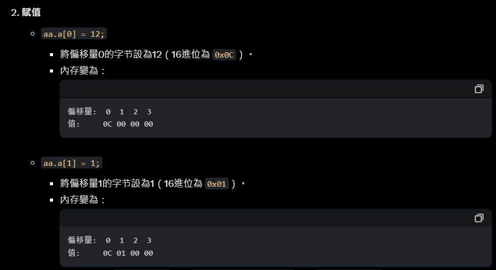

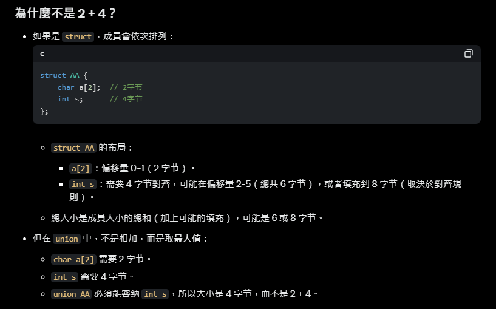

## 38. enum : 是一種常數定義方式，可以提升可讀性，enum 裡的識別字會以 int 的型態，從指定的值開始遞增排列 (預設為 0)

```c
enum color1 {
    red, 
    green, 
    blue,
    yellow
}; 
// red = 0, green = 1...

enum color2 {
    red=10, 
    green, 
    blue=20, 
    yellow
}; 
//red = 10, green = 11, blue = 20, yellow = 21
```

## 39. 二維陣列大小

```c
#include <stdio.h>
int main()
{
    int arr[3][4];
    printf("1:%d\n", sizeof(arr));  // 結果為 48（3 * 4 * 4(int)）
    char str[2][10];
    printf("2:%d\n", sizeof(str));  // 結果為 20（2 * 10 * 1(char)）
    int* ptr[5][3];
    printf("3:%d\n", sizeof(ptr));  // 結果為 120（5 * 3 * 8(int*)）
    struct Point 
    {
        int x;
        int y;
    };
    struct Point points[4][3];
    printf("4:%d\n", sizeof(points));  // 結果為 96（4 * 3 * 8(int+int=8)）
    return 0;
}
```

## 40. 各sizeof大小

```c
#include <stdio.h>

int main() {
    char *s = "hello"; 
    char s1[]={'h','e','l','l','o'}; 
    int s2[]={'h','e','l','l','o'}; 
    printf("%d\n", sizeof(s));  //ponit 32位元為4byte / 64位元為8byte
    printf("%d\n", sizeof(s1)); //1*5 = 5
    printf("%d\n", sizeof(s2)); //4*5 = 20
    return 0;
}
```

## 41. setting a bit

```c
int set_bit(int x, int n){
    return x | (1 << n);
}
```

## 42. clearing a bit

```c
int clear_bit(int x, int n){
    return x & ~(1 << n);
}
```

## 43. fliping a bit

```c
int flip_bit(int x, int n){
    return x ^ (1 << n);
}
```

## 44. checking a bit

```c
int check_bit(int x, int n){
    return (x >> n) & 1;
}
```

## 45. 回答ans的數值

```c
#include <stdio.h>

int main() {
    long ans = 0;
    short a = 0x1234;
    short b = 0x5600;
    ans += a << 16;
    ans += b << 0;
    ans += (b >> 2) + 0x22;
    printf("a=%x\n",ans);   // 12346BA2
}
```

## 46. 回答ans的數值2

```c
#include <stdio.h>

int main() {
    printf("ans=%d\n",fun(456)+fun(123)+fun(789));
}

int fun(int x){
   int count = 0 ;
   while(x){
      count++ ;
      x = x & (x-1) ;
   }
   return count ;
}
```

## 47. 0x12345678 轉換為 0x87654321

```c
#include <stdio.h>

unsigned int func(int x) {
    unsigned int n[8],sum = 0;
    n[0] = ((x & 0x0000000F) <<28);
    n[1] = ((x & 0x000000F0) <<20);
    n[2] = ((x & 0x00000F00) <<12);
    n[3] = ((x & 0x0000F000) <<4);
    n[4] = ((x & 0x000F0000) >>4);
    n[5] = ((x & 0x00F00000) >>12);
    n[6] = ((x & 0x0F000000) >>20);
    n[7] = ((x & 0xF0000000) >>28);
    for(int i=0; i<8; i++){
        sum += n[i];
    }
    return sum;
}

int main() {
    unsigned int data = 0x12345678;
    printf("轉換前: 0x%x\n", data);

    unsigned int swapped = func(data);
    printf("轉換後: 0x%x\n", swapped);

    return 0;
}
```

## 48. 給一個unsigned short, 問換算成16進制後,四個值是否相同? 若是回傳1,否則回傳0

```c
int function(unsigned short num) {
    unsigned short temp[4];
    temp[0] = (num&0xF000) >> 12;
    temp[1] = (num&0x0F00) >> 8;
    temp[2] = (num&0x00F0) >> 4;
    temp[3] = num&0x000F;
    if((temp[0] ^ temp[1] ^ temp[2] ^ temp[3]) == 0){
        return 1;
    }
    else{
        return 0;
    }
}

int main() {
    unsigned short num = 0xAAAA;
    printf("ans:%d\n",function(num));
    return 0;
}
```

## 49. bubbleSort版本1

```c
#include <stdio.h>

void bubbleSort(int arr[],int n){
    for(int i=0; i<n-1 ;i++){
        for(int j=i+1; j<n; j++){
            if(arr[i] > arr[j]){
                int temp = arr[j];
                arr[j] = arr[i];
                arr[i] = temp;
            }
        }
    }
}

int main()
{
    int arr[] = {64, 34, 25, 12, 22, 11, 90};
    int n = sizeof(arr)/sizeof(arr[0]);
    bubbleSort(arr, n);
    for (int i=0; i < n; i++)
        printf("%d ", arr[i]);
    return 0;
}
```

## 50. bubbleSort版本2

```c
#include <stdio.h>

void bubbleSort(int arr[], int n) {
    for (int i = 0; i < n - 1; i++) {
        for (int j = 0; j < n - i - 1; j++) {
            if (arr[j] > arr[j + 1]) {
                int temp = arr[j];
                arr[j] = arr[j + 1];
                arr[j + 1] = temp;
            }
        }
    }
}

int main() {
    int arr[] = {64, 7, 34, 25, 12, 22, 11, 90};
    int n = sizeof(arr) / sizeof(arr[0]);
    bubbleSort(arr, n);
    for (int i = 0; i < n; i++)
        printf("%d ", arr[i]);
    return 0;
}


```

## 51. 設定一個絕對位址為0x67a9的整數型變數的值為0xaa55

```c
#include <stdio.h>

int main(){
    int *ptr = (int *)0x67a9;
    *ptr = 0xaa55;
}
```

## 52. Ｎ是否為判斷2的次方

```c
int isPowerof2(int n) {
    return n > 0 && (n & (n - 1)) == 0;
}
```

## 53. 連續呼叫 func 10 次，印出的值為何？

```c
#include <stdio.h>

void func(void)
{
    static int i = 0 ; 
    i++ ;
    printf("%d" , i ) ;
}

int main(void)
{
    for(int i=0; i<10; i++)
        func(); 
}
 //若沒static，i會一直歸零
 // 12345678910
```

## 54. i++ & ++i

```c
#include <stdio.h>

int main()
{
    int i = 5;
    int j = i++;
    printf("i1 = %d\n",i);  
    printf("j1 = %d\n",j);  

    i = 5;
    j = ++i; 
    printf("i2 = %d\n",i);
    printf("j2 = %d\n",j);  
    return 0;
}
//ans : 6 5 6 6
```

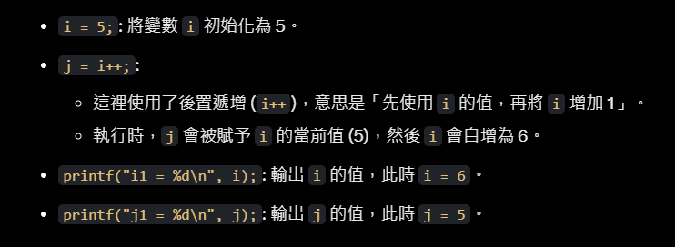
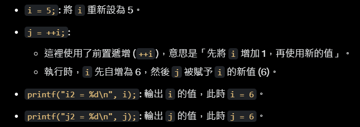

## 55. 寫個function判斷基數偶數

```c
if (num % 2 == 0) {
    printf("even\n");
} else {
    printf("odd\n");
}
```

## 56. 寫個function計算有幾個位元是 1

```c
int func(int x){
    int sum=0;
    while(x){
        x &= x-1;
        sum++;
    }
    return sum;
}
```

## 57. What is the output of the following program

```c
int main() {
    unsigned int a = 6;
    int b = -20;
    (a + b > 6) ? puts(">6") : puts("<= 6");
}

// 當表達式同時存在有符號類型和無符號類型時皆都自動轉換為無符號類型。
// 因此-20變成了一個非常大的正整數，所以該表達式計算出的結果大於6。
```

## 58. The faster way to an integer multiply by 7(乘以7)

```c
int main() {
    int i = 1;
    i = (i << 2) + (i << 1) + (i << 0);
    printf("i = %d\n",i);
}
```

## 59. declaration（宣告）和 definition（定義）的差異

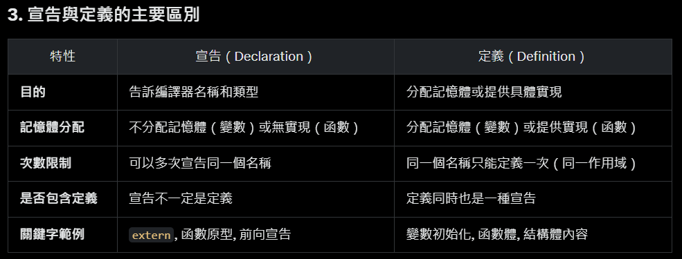
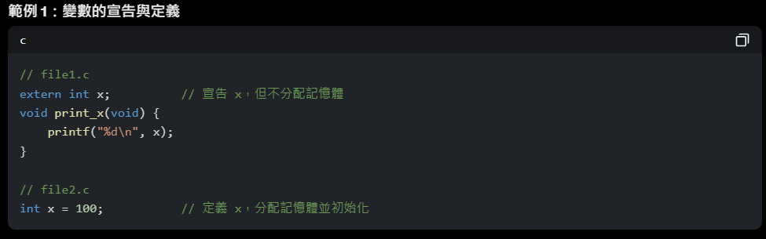

## 60. Big / Little-Endian : 他們是CPU中兩種不同位元組排序

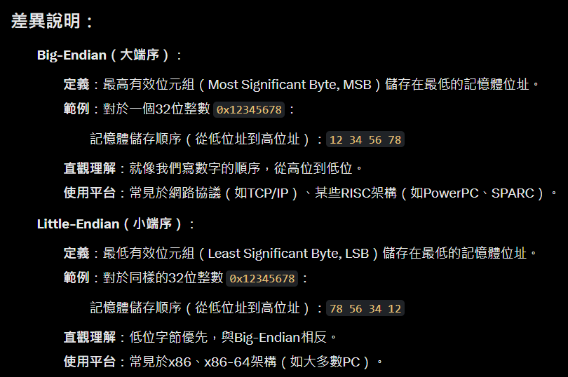

## 61. 費式數列，寫一個函數，輸入值是位置的值"n"，要找出相對應的值

```c
//一般解法
#include <stdio.h>

int fibonacci(int n) {
    if (n <= 1)
        return n;
    
    int prev = 0;
    int current = 1;
    int next;

    for (int i = 2; i <= n; i++) {
        next = prev + current;
        prev = current;
        current = next;
    }

    return current;
}

int main() {
    int n;
    printf("input:");
    scanf("%d",&n);
    printf("%d\n",fibonacci(n));
    return 0;
}
```

```c
//遞迴解法

int function(int n) {
  if(n == 0){ 
    return 0;
  }
  if(n == 1){ 
    return 1;
  }
  
  return function(n - 1) + function(n - 2); 
}

int main() {
    int n;
    printf("input:");
    scanf("%d",&n);
    printf("%d\n",function(n));
    return 0;
}
```

## 費式數列變化題

```c
#include <stdio.h>

int c;

int fib(int n){
    c++;
    if ((n==1)|| (n==2))
        return 1;
    return (fib(n-1)+fib(n-2));
}

int main(){
    c = 0;
    fib(5);
    printf("%d", c);        //9
    return 0;
}


逐步計算 fib(5)
斐波那契數列是這樣的：  
fib(1) = 1
fib(2) = 1
fib(3) = fib(2) + fib(1) = 1 + 1 = 2
fib(4) = fib(3) + fib(2) = 2 + 1 = 3
fib(5) = fib(4) + fib(3) = 3 + 2 = 5
但我們的目標不是計算斐波那契數的值，而是計算 fib 函數被呼叫的次數
（因為每次呼叫都會讓 c 增加 1）。讓我們模擬整個遞迴過程：
fib(5)"1" -> 
fib(4)"1" + fib(3)"1" -> 
fib(3)"1" + fib(2)"1" + fib(2)"1" + fib(1)"1" ->
fib(2)"1" + fib(1)"1"
```

## binary search

```c
#include <stdio.h>

int binary_search(int arr[], int left, int right, int target){
    while(left <= right){
        int mid = left + (right - left)/2;
        if(arr[mid] == target)
            return mid;
        else if(arr[mid] > target)
            right = mid - 1;
        else
            left = mid + 1;
    }
    return -1;
}

int main(){
    int arr[] ={1,2,3,5,7,9,12,18,22};
    int n = sizeof(arr)/sizeof(arr[0]);
    int result = binary_search(arr,0,n-1,2);
    printf("res=%d\n",result);
    return 0;
}
// 考虑以下情况：

// 如果直接使用 mid = (right - left) / 2，那么 mid 的范围将始终是从 0 到 (right - left) / 2。
// 但实际上，我们希望 mid 的范围是从 left 到 right。
// 因此，为了保持 mid 在正确的范围内，我们需要加上 left 的偏移量，即 mid = left + (right - left) / 2。

// 这样，mid 的计算结果将是一个介于 left 和 right 之间的值，确保每次迭代时都在正确的搜索范围内进行比较，从而正确地找到目标元素。
```

## 求一個數的最高位1在第幾位

```c
#include <stdio.h>

int function(int num){
    int cnt = 0;
    while(num){
        if(num&1 == 1){
            cnt++;
        }
        num >>= 1;
    }
    return cnt-1;
}

int main() {
    int num = 15;
    printf("ans:%d\n",function(num));
    return 0;
}
```

## 最大公因數 遞迴寫法

```c
#include <stdio.h>

int gcd(int a, int b) {
    if(b == 0)
        return a;
    return gcd(b,a%b);
}

int main() {
    printf("GCD: %d\n", gcd(15,5));

    return 0;
}
```

## 0~500個數字每次隨機 取一個數字出來，但下次在抽出時不可以出現已經抽過的數字，問你如何時實現

## 一般解法

```c
#include <stdio.h>
#include <stdlib.h>

#define NUM 501

void func(int *nums){
    int count = 0;
    while(count < NUM){
        int temp = rand() % NUM;
        if(nums[temp] == 0){
            nums[temp] = 1;
            count++;
            printf("%d ",temp);
        }
    }
}

int main(){
    int nums[NUM];
    for(int i=0; i<NUM; i++){
        nums[i] = 0;
    }
    func(nums);
    return 0;
}
```

## 進階解法(還不熟)

```c
#include <stdio.h>
#include <stdlib.h>

void swap(int* a, int* b){
    int temp = *a;
    *a = *b;
    *b = temp;
}

int main()
{
    int nums[501];
    for(int i=0; i<501; i++){
        nums[i] = i;
    }
    int final = 500;
    int choose;
    while(final >= 0){
        choose = rand()%(final+1);
        printf("%d ",nums[choose]);
        swap(&nums[choose], &nums[final]);
        final--;
    }
}
```

## 請問以下MIN()的結果為何?

```c
#define MIN(a,b) (a < b ? a : b)
int result = 2 * MIN(6,10); 
// return 10
```

## #error

```text
在C語言中，#error是一個預處理器指令，用於在編譯時生成錯誤訊息。當編譯器遇到#error指令時，它會立即停止編譯，並將指定的錯誤訊息輸出到編譯器的錯誤信息中。
```

```c
#ifndef DEBUG
#error "You must define the DEBUG macro"
#endif
```

## Explain lvalue and rvalue

## lvalue：左值通常指的是運算式後還保留其狀態的一個物件，通常指的是所有的變數都是左值

rvalue：右值通常指的是一個運算式過後其狀態就不會被保留了，也就是一個暫時存在的數值

```c
int a = 5;  // a 是 lvalue,5 是 rvalue
```

## 機智問答

## 有九顆看起來一模一樣的球 但是有一顆不一樣重 也不知道它是比較輕還比較重 用一個天秤最少要量幾次可以"確保"找出這顆球?

```text
Ans : 3次

將9顆球分成A,B,C共3堆，每堆3顆球
A.ooo    B.ooo   C.ooo
                                                     
[第1次]
拿A,B堆共6顆球分別放在天秤兩端
(i)假設不一樣重，就能知道想找的球在A,B其中之一
(ii)假設一樣重，就知道不一樣重的球是剩下沒秤的3顆其中之一

[第2次]
換掉輕的3顆(假設B較A輕)，拿另外C堆的3顆上來量
假設天秤平衡了，就能知道不一樣重的球較輕
是剛剛被換掉的B堆3顆其中之一                                                 
                                                                          
[第3次]    
拿B堆3顆的其中2顆來量
如果平衡了，那麼要找的就是剩下的第3顆較輕的球
```

## 從1數到100 喊到100的人獲勝 每一次最少喊一個數 最多喊七個數 先攻的人喊到幾時便保證必勝?

```text
Ans：
如果自己要喊100，對方必須只能喊99~93，
自己要喊  92，對方必須只能喊91~85，
...........................
自己要喊  12，對方必須只能喊11~5，
自己要喊  4

因此只要先喊到4，則先喊的人必獲勝，往後原則就是喊100-8n
```

## 有個商品賣30元 成本25元 客人用100元紙鈔跟商人買了商品 商人沒錢找所以拿了這張紙鈔去跟隔壁攤販換零錢找給客人後來隔壁攤販跑來說那是假鈔 所以商人又賠了100元給隔壁攤販 試問商人總共虧多少錢?

```text
Ans：
-100+5 = -95
```

## 用若干個砝碼組合出1～100公克，請問砝碼最少數量為幾個?

```text
Ans：
7個 (1,2,4,8,16,32,64)
```

## 有1支手電筒和5個人，這5個人要過橋，過橋單趟每個人分別需要花費1、3、5、11、13分鐘。橋一次最多只能有兩個人在上面，而且每次過橋都一定要拿著手電筒過去，請問最少花費幾分鐘所有人可以過完橋?

```text
1、3 過去，1回來 ( 3 + 1 = 4 min.)
11、13過去，3回來 ( 13 + 3 = 16 min.)
1、3過去，1回來 or 1、5過去，1回來 ( 3 + 1 = 4 min. or 5 + 1 = 6 min.)
1、5過去 or 1、3過去 (5 min. or 3 min.)
總共花費29分鐘
```

## if(b() && a()) 這樣的寫法會有啥問題?

```text
如果 A() 的 function 會影響到 b() 的結果可能就會影響最後程式的結果，
所以需要注意程式邏輯跟條件的順序
```

## 判斷閏年(能被4整除但不能被100整除,或是能被400整除)

```c
#include <stdio.h>
#include <stdlib.h>

int main()
{
    int year;
    printf("請輸入西元年 : ");
    scanf("%d",&year);
    if((year%4) == 0 && (year%100) != 0 || (year%400) == 0)
    {
        printf("%d是閏年\n",year);
    }
    else
    {
        printf("%d是平年\n",year);
    } 
    return 0;
}
```

## 輸入一unsigned int n，當輸入0則輸出0，輸入1-32為輸出32，33-64輸出64，65-96輸出96 (32進位)

```c
#include <stdio.h>

int mul_32(unsigned int x){
    x = x + 31;
    x = x & ~31; 
    return x;
}

int main()
{
    printf("%d\n",mul_32(5));
    return 0;
}
```

## 寫出質數function

## 一般解法

```c
#include <stdio.h>

int func(int num){
    if(num == 0){
        return 0;
    }
    for(int i=2; i<num; i++){
        if(num%i == 0){
            return 0;
        }
    }
    return 1;
}

int main()
{
    int input;
    printf("input:");
    scanf("%d",&input);

    if(func(input)){
        printf("yes\n");
    }
    else{
        printf("no\n");
    }
    return 0;
}
```

## 進階解法

```c
#include <stdio.h>

int gcd(int a, int b){
    return a%b==0 ? b : gcd(b, a%b);
}

int main(){
    int a,b;
    while(scanf("%d%d", &a, &b)){
        if(gcd(a,b) == 1)
            printf("互質\n");
        else
            printf("不互質\n");
    }
    return 0;
}

// 判斷質數的方法，就是要找因數，第一個做法是找出所有的因數
// 而我們不需要找所有的因數，只需要找一半的因數就行了
// 例如: 16的因數:1, 2, 4, 8, 16
// i=4的時候，i*i=4*4<=16，執行完迴圈就結束了
// 而8呢? 因為判斷質數，如果16能被2整除，那表示也能被8整除，因為2*8=16
```

## I2C Protocol

## 介紹

```text
1. SDA : Serial Data Line, holds Data or address signal

2. SCL : Serial Clock Line, holds Clock signal

3. IO 必須是 open drain (導通時是低電位，不導通時float，所以利用上拉電阻將電位拉高)
```

## 時序

```text
1. I²C bus 上無任何活動時，SCL 和 SDA 都維持在 high
2. SCL 為 low 時，SDA 的狀態"可改變"(藍色)
3. SCL 為 high 時， SDA 上的資料"有效"(綠色)
4. SCL 為 high 時，若 SDA 變動則兩種特殊狀況：
- SDA H->L : START
- SDA L->H : STOP
```

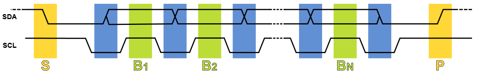

## ack

```text
1. 每一個 Byte 的資料傳輸結束後，會跟著一個 ack bit。這個 ack bit 固定由接收方產生，有以下兩種：
- 當 master 是傳送方、slave 是接收方，ack 由 slave 回應
- 當 master 是接收方、slave 是傳送方，ack 由 master 回應

1. ack 定義：
0(ack)  - OK
1(nack) - FAIL
```

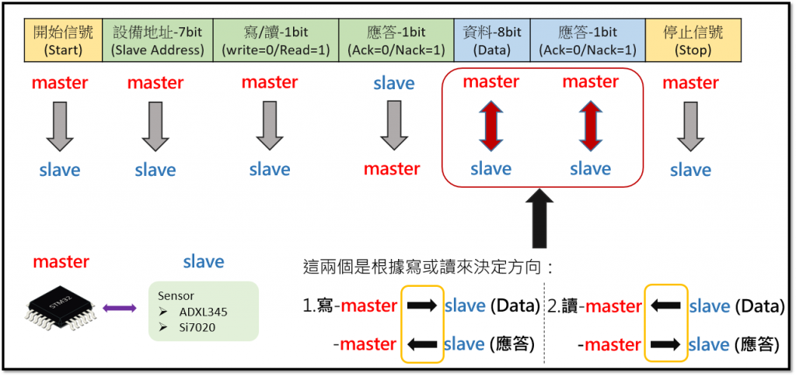

## I2C寫入範例

```text
1. 紫色(SDA)、藍色(SCL)
2. 當 SDA 由 H->L 且 SCL 為 H，開始資料傳輸
3. Master 寫入設備地址(0b0101010)後再寫入wirte byte(0)
4. Slave 回應 0(ack)
5. Master 寫入資料(0b00110000)
6. Slave 回應 0(ack)，寫入完成
7. SDA 由 L->H 且 SCL 為 H，結束資料傳輸
```

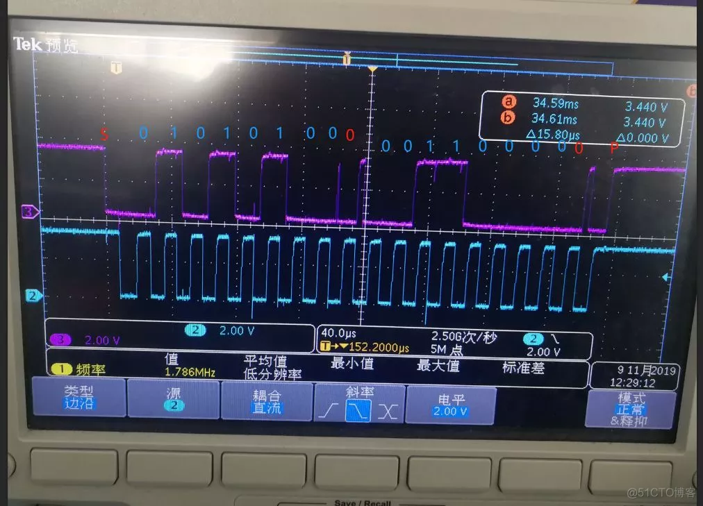

## I2C讀取範例

```text
1. 紫色(SDA)、藍色(SCL)
2. 當 SDA 由 H->L 且 SCL 為 H，開始資料傳輸
3. Master 寫入設備地址(0b0101010)後再寫入read byte(1)
4. Slave 回應 0(ack)
5. Slave 丟出資料(0b00110000)
6. Master 回應 1(nack)，停止讀取data
7. SDA 由 L->H 且 SCL 為 H，結束資料傳輸
```

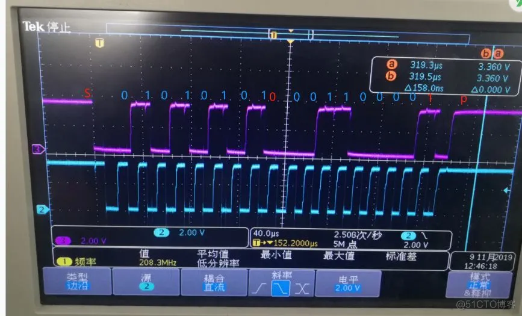

## SPI Protocol

## 介紹

```text
SPI 的通訊協定有兩個重要的參數 CPOL/CPHA，說明如下。

1、CPOL (Clock Polarity)
- CPOL=0，時脈極性為 0 代表 SCK 空閒狀態為“L”
- CPOL=1，時脈極性為 1 代表 SCK 空閒狀態為“H”

2、CPHA (Clock Phase)
- CPHA=0，時脈相位為 0 代表數據會在“第一個 SCK 改變凖位”時被採樣
- CPHA=1，時脈相位為 1 代表數據會在“第二個 SCK 改變凖位”時被採樣
```

## CPOL = 0 / CPHA = 0

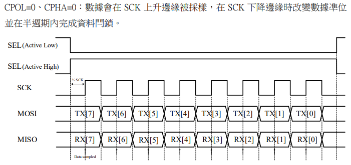

## CPOL = 0 / CPHA = 1

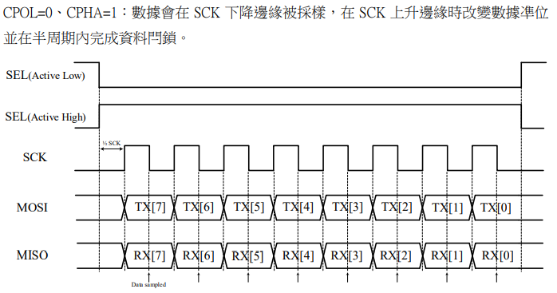

## CPOL = 1 / CPHA = 0

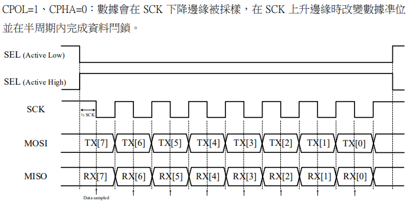

## CPOL = 1 / CPHA = 1

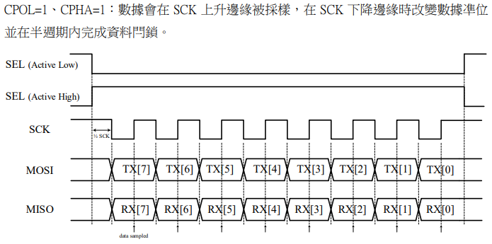
