# **Power Delivery & DP**

---
## *USB Type-C Power/Data 角色介紹*

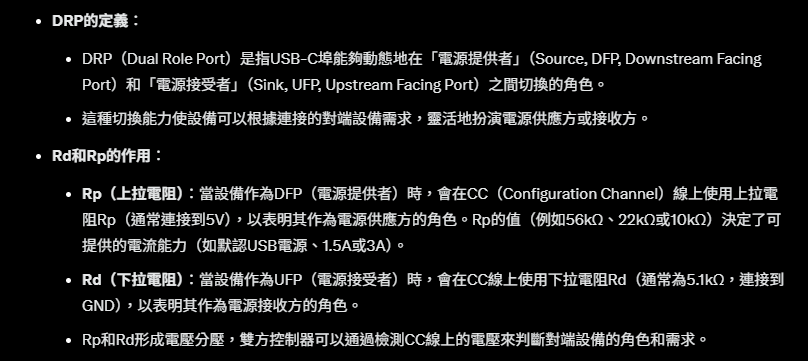
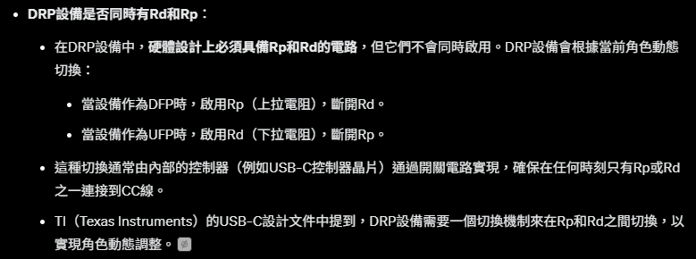
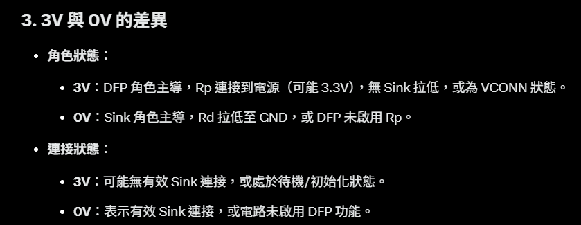

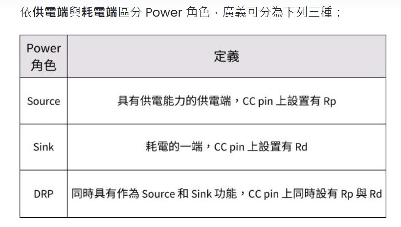
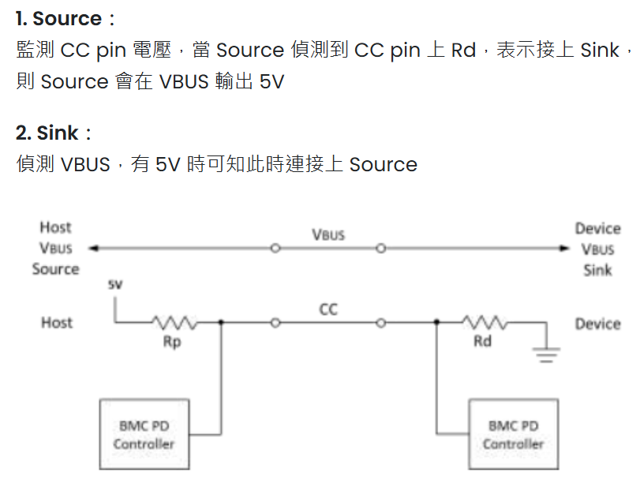
Source 參考線材可支援的條件，送出 Source Capabilities 給 Sink 表示當下狀態的供電能力，Sink 會依需求從中選擇且回 Request 向 Source 要求當下需要的電壓電流，Source 收到後確認可以此條件供電就會回覆Accept，並且在狀態準備好之後再發 PS RDY。至此步驟 Explicit PD Contract 完成，在這之後雙方可再視狀況，重新協議新的 PD contract。
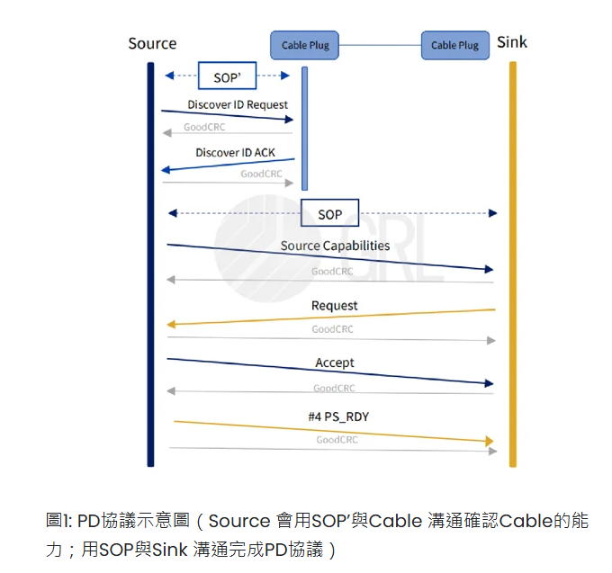

## *Enter Alternate Modes介紹*

1. DFP會先發出Discover Identity Request訊息來確認UFP的身份和能力，在UFP回覆的Discover Identity ACK訊息中有個Modal Operation Supported的欄位，用來表示UFP是否支援Alternate Modes。
2. Discover階段可以分成兩部分，第一階段DFP會先發出Discover SVID Request訊息來確認UFP支援多少Alternate Modes。SVID包含由協會制定的SID和協會所提供各家廠商的VID，常見的SVID有0x8087 (Thunderbolt mode)、0xFF01 (Displayport mode)。確認UFP回覆的SVID後，第二階段DFP會發出Discover Modes訊息，其中包含DFP支援的SVID，目的是為了確認雙方都有支援這些Mode，UFP會以Discover Modes Ack訊息來表示有支援。
3. DFP發出Enter Mode來告知UFP要切換的Mode，確認到UFP的Enter Modes Ack訊息後，雙方切換成溝通好的Mode。直到要結束工作模式，DFP會以Exit Mode訊息來告知UFP。
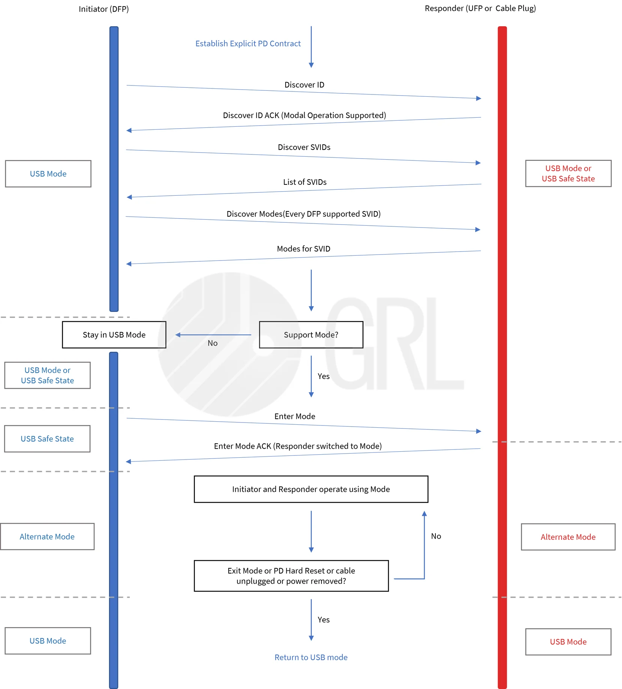

## *實際範例*

## *Power Role Swap 介紹*

誰能夠負責發起PR_Swap的訊息呢？筆電還是Dock？Source還是Sink？答案是，Source和Sink 雙方皆可。但收到PR_Swap 要求的一方也可以視自身能力和當前狀況回應「接受（Accept）」、「拒絕（Reject）」或「等待（Wait）」的訊息來決定是否進行PR Swap的動作。
圖二我們以Sink發起PR_Swap訊息為例，說明PR Swap 一連串的過程及PD規範中對於PR Swap時CC切換和VBus電壓轉換的流程，圖三則是利用GRL-A1記錄下VBus在PR Swap 過程的變化：

#1 Sink在發起PR_Swap後，#2、#3 Source接受PR Swap後發出Accept 的訊息並將CC Pin上的Rp切換到Rd後發出PS_RDY成為New Sink。假如初始Source 不接受PR Swap或是正在忙碌需要Sink 等待，則可在收到PR_Swap的請求後分別發出Reject 和Wait的訊息。
#4當初始Sink 收到從New Sink發出的PS_RDY後，原始Sink 也會將Rd切換到Rp成為New Source並發出PS_RDY，此時，PR Swap基本上就完成了。
最後New Source會再發出新的Source Cap.與New Sink完成新的PD協議。
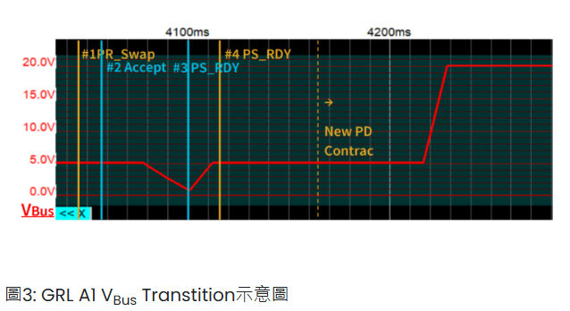

## *Fast Role Swap 介紹*

當Dock偵測到電壓下降，會隨即發出一個Fast Role Swap signal，Host 接收到訊號後，便會傳送FR_Swap的訊息用以完成Source 和Sink 角色的交換，後面的溝通流程大致與PR Swap相同。除了在Role Swap訊息溝通前會有一個Fast Role Swap Signal外，FR Swap與PR Swap 最大的不同， 可以說是VBus的切換時間， 若原先Dock與Host之間的VBus電壓 >5V，那麼當Sink 發現VBus <VSafe5V時，Sink隨時都會供給VBus電源，即便此時的Sink 尚未完成FR Swap的 PD 溝通成為Source，Sink（Host）在此時為了維持與Dock之間的連接以及和Device的資料傳輸而緊急供給VSafe5V。

## *顯示器主要參數*

## *解析度（Resolution）*

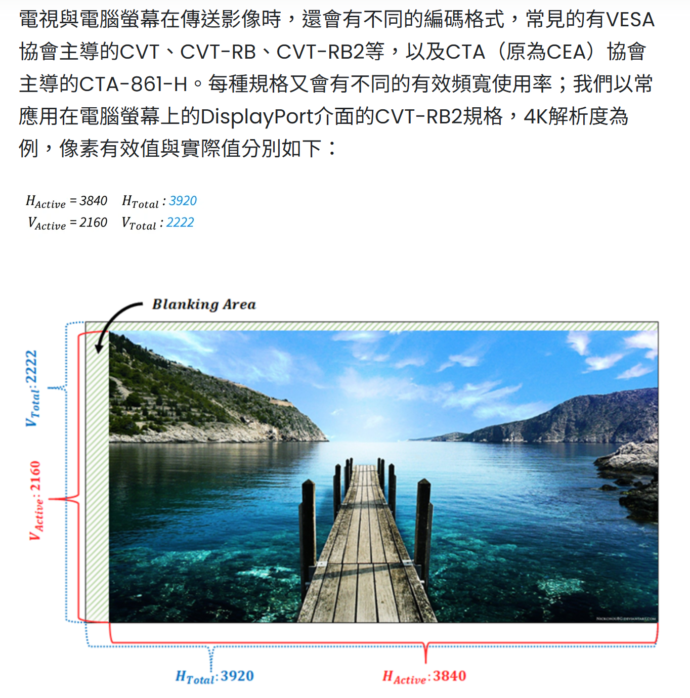

## *更新率（Refresh Rate）*

## *色彩格式（Color Format）*

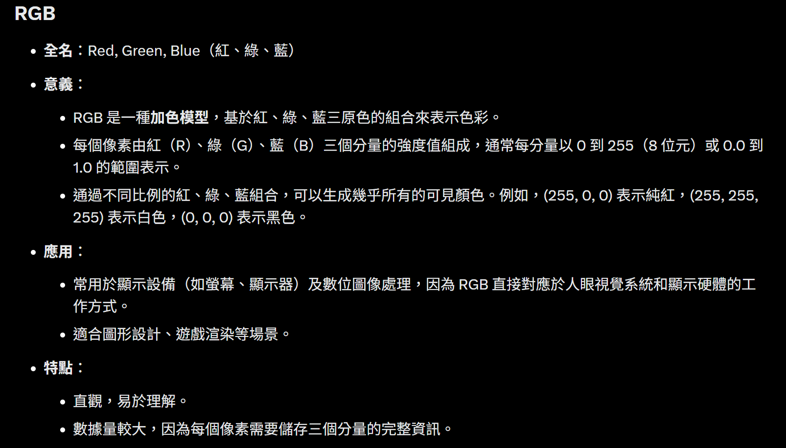
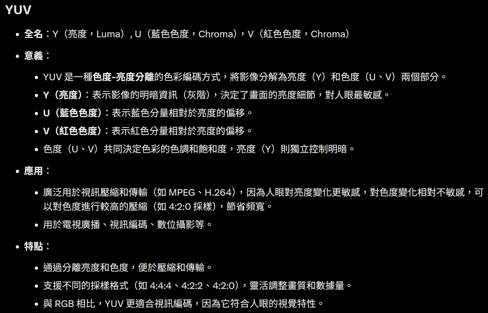
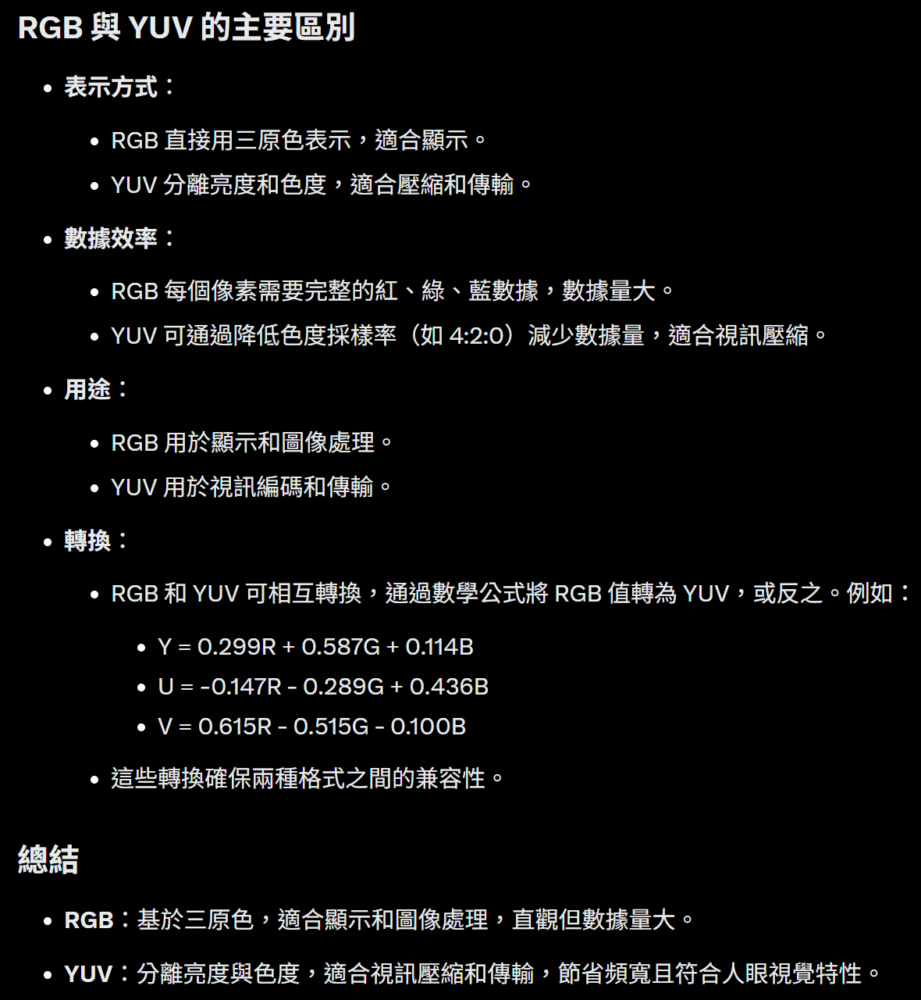

## *色彩深度（Color Depth）*

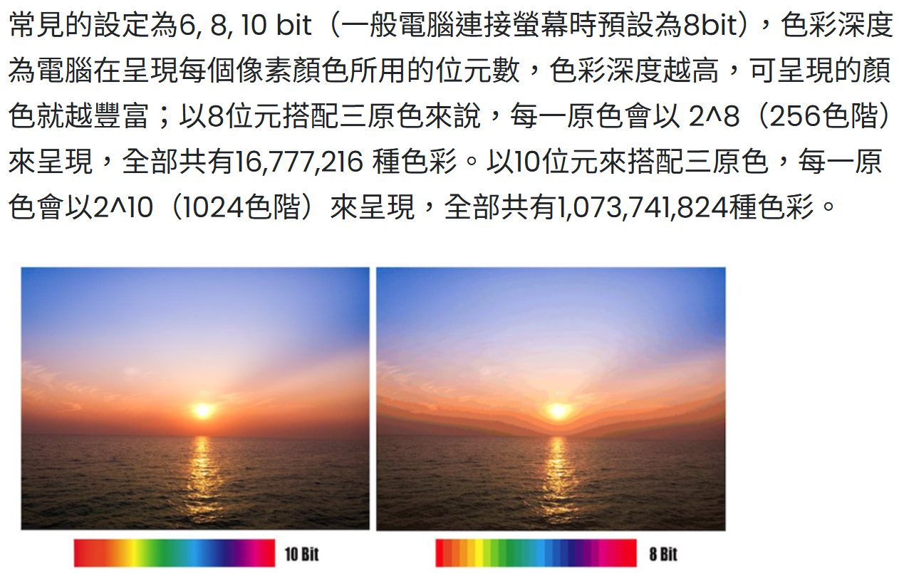

## *其他螢幕常見功能（HDR10、Dolby Vision等）*

## *頻寬計算*

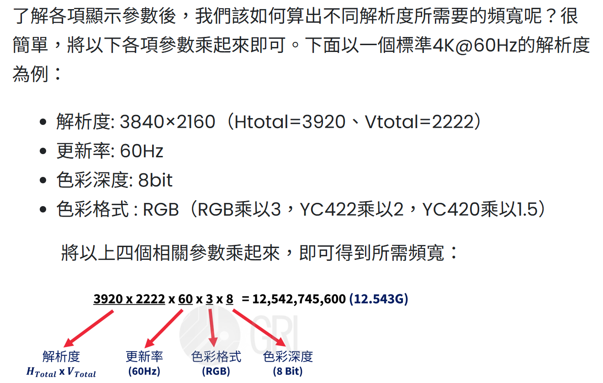
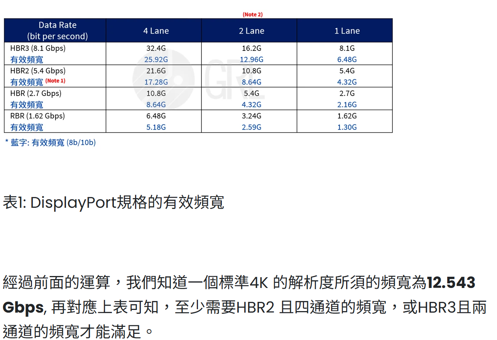

## *SOP Communication*

Source 與 Sink 之間使用 SOP 訊息，靠近 Vconn Source (負責供電給線材中 e-Marker) 訊息使用 SOP’，與較遠端 e-Marker 的訊息則用 SOP’’。

並非每一條線材都有搭載 e-Marker，若該線材支援 SuperSpeed 或大於 3 安培的電流，依規定就必須有 eMarker

## *Data Role Swap 介紹*

了解Power Role的角色轉換之後，接著我們看到Data角色的轉換，Data Role Swap （DR Swap）同樣是利用PD協議來完成。那麼為什麼需要DR Swap呢？因為對於DRP 的Data角色來說，雙方一對接上，並在完成第一次的PD協議之前，隨機成為Source的一方會預設為DFP，反之，Sink則為UFP，所以當初步的PD協議完成後，產品一樣也可以依照需求提出DR Swap的要求。

DR Swap的整個流程（圖五）相對於PR Swap來說簡單的多，要留意的是，若收到DR_Swap Requst的當下，DFP/UFP已進入任一Active Mode，那麼在進行DR Swap前需先執行Hard Reset使雙方離開Active Mode 再重新PD 協議，若Cable也在Active Mode時，則Cable也需先離開Active Mode。
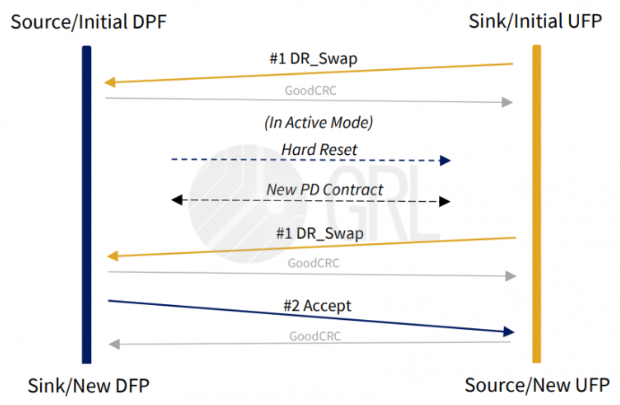

## *VCONN Swap 介紹*

#1 Initial VCONN Source 發出VCONN_Swap。

#2 、#3 UFP在接受VCONN_Swap後接受請求回覆Accept訊息，此時UFP 開始對VCONN 供電並在tVONNSourceOn（表四）時間內發出PS_RDY；假如接收VCONN_Swap的一方不接受VCONN Swap或是需要VCONN Source等待，則可在收到VCONN_Swap的請求後分別發出Reject 和Wait的訊息，若是不支援當VCONN Source則可發Not_Supported。但要注意若收到VCONN_Swap請求的一方現為VCONN Source，那麼是不能夠Reject 和Wait的。

而#4 Initial VCONN Source在收到PS_RDY後，則在tVCONNSourceOff（表四）時間內關閉VCONN 供電，完成VCONN Swap動作。此時，可以發現與PR Swap不同的是，VCONN在過程中都不會斷電，來確保維持Cable的運作。
完成 VCONN Swap 後，New VCONN Source 需要用SOP’/SOP” 對Cable做Soft Reset，用以重新同步Message ID。
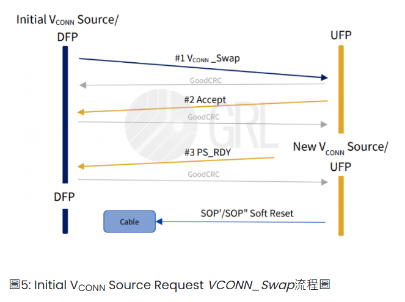